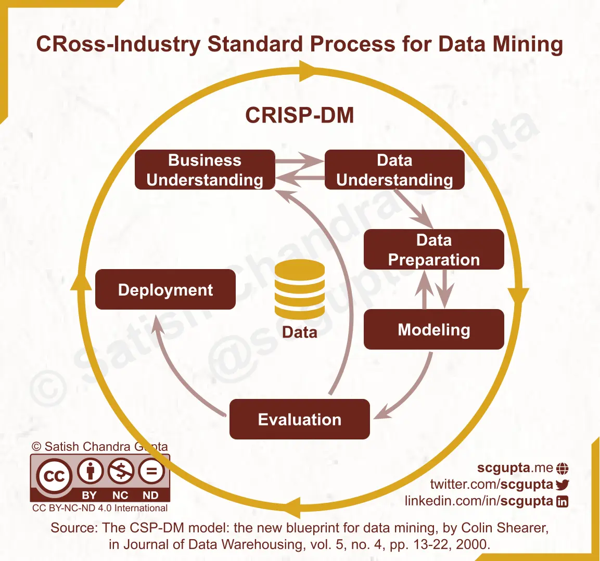
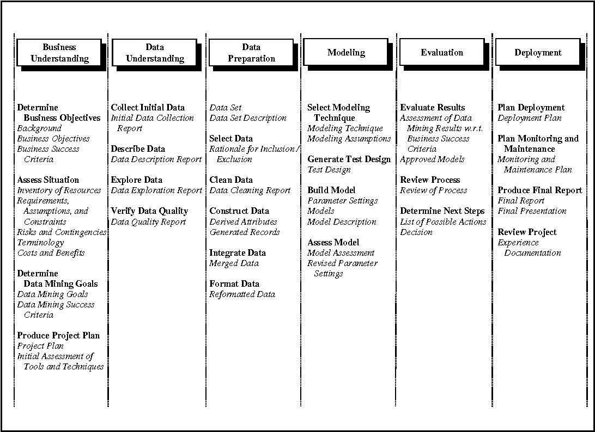
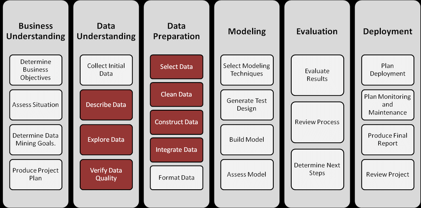

<h3> Context </h3>

<b>Garment productivit</b> The Garment Industry is one of the key examples of the industrial globalization of this modern era. It is a highly labour-intensive industry with lots of manual processes. Satisfying the huge global demand for garment products is mostly dependent on the production and delivery performance of the employees in the garment manufacturing companies. So, it is highly desirable among the decision makers in the garments industry to track, analyse and predict the productivity performance of the working teams in their factories.

<h3> Content </h3>
This dataset includes important attributes of the productivity of the employees which had been collected manually and also been validated by the industry experts.

<h3>Variable Information</h3>
<pre>
01	date			 :	Date in MM-DD-YYYY 
02	day			 :	Day of the Week 
03	quarter			 :	A portion of the month. A month was divided into four quarters 
04	department		 :	Associated department with the instance 
05	team_no			 :	Associated team number with the instance 
06	no_of_workers		 :	Number of workers in each team 
07	no_of_style_change	:	Number of changes in the style of a particular product 
08	targeted_productivity	:	Targeted productivity set by the Authority for each team for each day. 
09	smv		        :	Standard Minute Value, it is the allocated time for a task 
10	wip		        :	Work in progress. Includes the number of unfinished items for products 
11	over_time	        :	Represents the amount of overtime by each team in minutes 
12	incentive	        :	Represents the amount of financial incentive (in BDT) that enables or motivates a particular course of action. 
13	idle_time	        :	The amount of time when the production was interrupted due to several reasons 
14	idle_men	        :	The number of workers who were idle due to production interruption 
15	actual_productivity	:	The actual % of productivity that was delivered by the workers. It ranges from 0-1.<be>
	</pre>

<h3>Associated tasks</h3>
	- Regression: 
		Predication of the productivity performance of the working teams in their factories.
  

<h3>CRISP-DM the model that I'm using in this project:</h3>

 

 

<h3> Business Understanding </h3>

<ul>
	<li>What are the major challenges the company is facing?</li>
	<li>What are the key performance indicators (KPIs) or metrics that the company aims to improve?</li>
	<li>What does success look like for the business in this area?</li>
</ul>
<pre>
	predicting if the workers can achieve the set target
	Identifying the top factors influencing the productivity level of employees.
	How to increase employee productivity and predicting if we have a low or medium or hight productivity
</pre>

<h3> Data Science Objective Success: </h3>

<pre>
Achieve a model precision of 80% or higher.
Reduce false positives	
</pre>

<a href='./data/dataProductivity Prediction of Garment Employeese.csv'>link</a>

